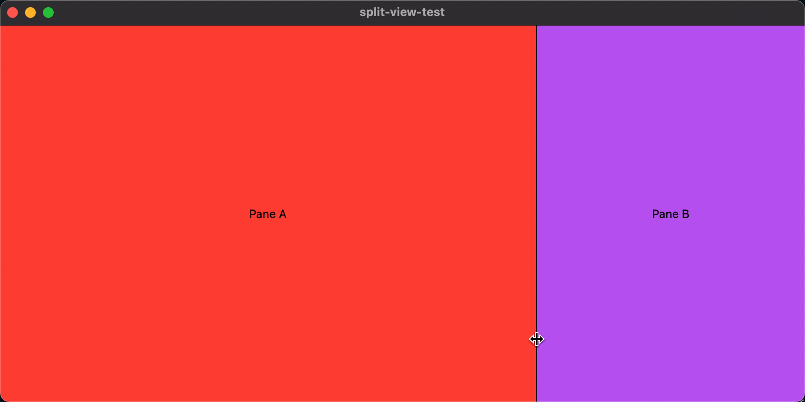

# split-view-test

This is a basic test case to show an odd `HSplitView` behavior I've encountered when writing SwiftUI code.

## Behavior 

The problem is that if one view has a `maxWidth` set, dragging the divider can resize it to be larger than the declared max width. After letting go of the divider, it will adjust itself to be the max width as expected.

## Reproduction

Create two views in a single `HSplitView` and add a non-infinite `maxWidth` on one of the views (B). The other (A) should have `maxWidth: .infinity` to take up the remaining space. When running, use your mouse to drag the divider and make the B view larger and keep going beyond the declared `maxWidth`. Note that view A shrinks in response. Let go of your mouse button and notice that view B adjusts to be within the declared `frame` parameters.

## Expected behavior

I would expect the view to stop resizing at the `maxWidth`, rather than continue to expand with the mouse cursor. This is how, for example, the `SF Symbols` app works with the inspector pane on the left.

## Demo

Here are two visual demos, one showing the observed behavior from this app, and the other from the SF Symbols app, which the app should do.

### Current



### Expected


### Main code

The [ContentView](split-view-test/ContentView.swift) has all the demo code in a few view structs.

```swift
import SwiftUI

struct A: View {
    var body: some View {
        VStack {
            Spacer()
            
            HStack {
                Spacer()
                
                Text("Pane A")
                
                Spacer()
            }
            
            Spacer()
        }
        .frame(
            minWidth: 200,
            maxWidth: .infinity,
            maxHeight: .infinity,
            alignment: .leading
        )
        .background(Color.red)
        .foregroundColor(.black)
        .layoutPriority(1)
    }
}

struct B: View {
    var body: some View {
        VStack {
            Spacer()
            
            HStack {
                Spacer()
                
                Text("Pane B")
                
                Spacer()
            }
            
            Spacer()
        }
        .frame(
            minWidth: 200,
            idealWidth: 250,
            maxWidth: 300,
            maxHeight: .infinity
        )
        .background(Color.purple)
        .foregroundColor(.black)
    }
}

struct ContentView: View {
    var body: some View {
        HSplitView {
            A()
            B()
        }.frame(maxWidth: .infinity, maxHeight: .infinity)
    }
}

struct ContentView_Previews: PreviewProvider {
    static var previews: some View {
        ContentView()
    }
}
```

# [License](LICENSE.md)
